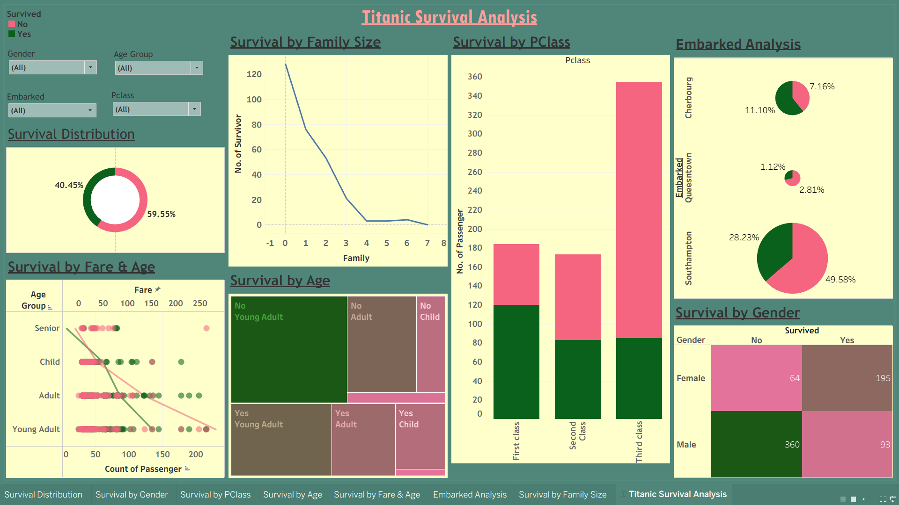

# 🚢 Titanic Survival Analysis Dashboard (Tableau)

## 📊 Project Overview
This project presents an interactive Tableau dashboard analyzing the Titanic dataset to uncover key survival patterns based on passenger demographics, class, and travel details.

The goal is to transform raw data into meaningful insights through effective visualization and storytelling.

---

## 🎯 Objective
- Analyze survival distribution across different features  
- Identify key factors influencing survival  
- Build an interactive dashboard for decision-driven insights  

---

## 📁 Dataset
- Titanic Dataset  
- Total Passengers: 891  
- Features:
  - Age, Gender, Passenger Class  
  - Fare, Embarked Location  
  - Family Size  

---

## 📊 Key Insights (From Dashboard)

### 🔹 Survival Distribution
- Survived: **40.45%**
- Not Survived: **59.55%**

---

### 🔹 Gender Analysis
- Female: **195 survived | 64 not survived (~75% survival)**
- Male: **93 survived | 360 not survived (~20% survival)**

👉 Gender was the most influential survival factor

---

### 🔹 Passenger Class Impact
- 1st Class → Highest survival count  
- 3rd Class → Lowest survival proportion  

👉 Strong class-based survival disparity

---

### 🔹 Family Size Analysis
- Smaller families had higher survival rates  
- Larger families had lower survival probability  

---

### 🔹 Embarkation Analysis
- Majority boarded from **Southampton**  
- Survival varies across ports  

---

## 📈 Dashboard Features

✔ Interactive filters (Gender, Age, Class, Embarked)  
✔ Survival breakdown by multiple dimensions  
✔ KPI cards for quick insights  
✔ Visual storytelling layout  
✔ Comparative charts and treemaps  

---

## 📷 Dashboard Preview

---

## 🎥 Demo
[▶️ Watch Dashboard Demo](https://public.tableau.com/views/TitanticSurvivalAnalysis/TitanicSurvivalAnalysis?:language=en-US&publish=yes&:sid=&:redirect=auth&:display_count=n&:origin=viz_share_link)

---

## 🛠 Tech Stack
- Tableau  
- Data Cleaning & Transformation  
- Data Visualization  

---

## 💡 Key Takeaways
- Gender and class strongly influenced survival  
- Socio-economic status played a critical role  
- Data visualization helps uncover hidden patterns  

---

## 🚀 Future Improvements
- Add predictive model (ML survival prediction)  

---

## ⭐ Support
If you found this useful:
⭐ Star the repo  
🔗 Connect with me  

---

## 🔖 Tags
`Tableau` `DataAnalytics` `Dashboard` `Visualization` `TitanicDataset`
